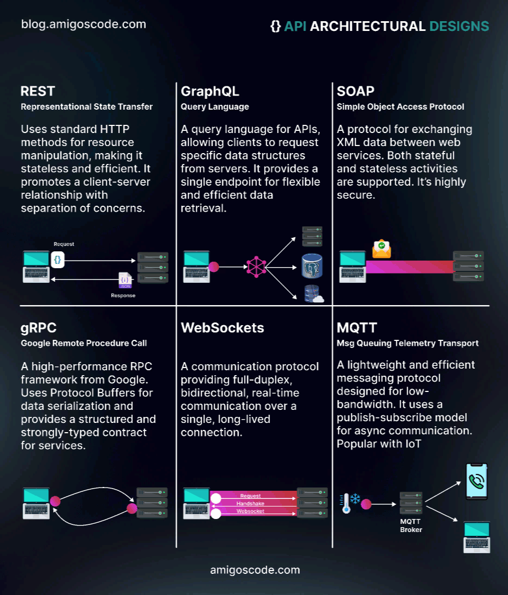

# Getting Started with Rest Service
A sample spring boot rest application and demo rest methods. 
A lot of other concepts covered in readme. \n
Here's a table of contents for this README doc:
---
1. **Introduction**
   - Brief overview of the "getting-started-with-rest-service" project.

2. **Networking Concepts**
   - Explanation of IPv4 and IPv6.

3. **Protocols**
   - Description of various networking protocols like IP, TCP, UDP, HTTP, FTP, SSH, SFTP, DNS, and NIC Card.

4. **What is REST**
   - Introduction to REST and RESTful APIs.

5. **API Architectural Designs You Must Know**
   - Overview of different API architectural designs, including REST, GraphQL, SOAP, gRPC, WebSockets, and MQTT.

6. **Request URL Example for REST**
   - Explanation of a REST request URL with its components.

7. **What is Spring Framework and How Spring Boot and Spring MVC Are Different**
   - Distinction between Spring Framework, Spring Boot, and Spring MVC.

8. **Spring Boot Profiles**
   - Explanation of managing multiple profiles in Spring Boot for different environments.

9. **Important Spring Boot Annotations**
   - Overview of significant annotations used in Spring Boot.

10. **Logging in Java Application**
    - Information about logging in Java applications and SLF4J.

11. **Logging Levels**
    - Description of various logging levels, including error, warn, info, debug, and trace.

12. **Reference**
    - A reference to an external tutorial.
---

## Networking Concepts
IPv4 -> 4 octets -> 4*8 =32 bits -> 2^32

1.2.3.4
255.240.10.20
------------------------
IPv6
0 -> 0000
1 -> 0001
2 -> 0010
3 -> 0011
4 -> 0100
5 -> 0101
6 -> 0110
7 -> 0111
8 -> 1000
9 -> 1001
A -> 1010
B -> 1011
C -> 1100
D -> 1101
E -> 1110
F -> 1111

AAAA:BBBB:AABB:CCBB:DDAA:BEEB:AAFF:BBAA
16+   16+  16+  16+  16+  16+  16+  16 =128
---

## Protocols
1. IP protocol -> Machine has an IP on the internet
   Port -> Communication channel for a service 
2. TCP - IP Protocol + port -> Transmission control protocol -> Connection oriented 
3. UDP - User datagram protocol -> Connection oriented 
4. HTTP ->  TCP protocol over 80 port =(IP + Port) + 80 port reserved 
5. FTP -> File transfer protocol -> 20-21 
6. SSH -> Secure Shell -> 22 
7. SFTP -> Secure FTP ->
8. DNS -> Domain name Service -> 53
9.NIC Card -> N/w interface card, Number of NIC cards = Number of IP address

---
## What is REST

REST (Representational State Transfer) is an architectural style used in web development for building scalable, performant, and maintainable web services. RESTful API (Application Programming Interface) is an implementation of the REST architecture.

RESTful API is a type of web API that is designed to work with HTTP (Hypertext Transfer Protocol) requests such as `GET`, `POST`, `PUT`, `DELETE`, etc., to retrieve, create, update or delete resources on the web. RESTful APIs use HTTP methods to define the actions to be performed on resources, and use URLs (Uniform Resource Locators) to identify resources.

RESTful APIs typically return data in JSON (JavaScript Object Notation) or XML (Extensible Markup Language) format, which are both lightweight and easy to parse. They also use hypermedia links to navigate between resources and represent the state of the system.

RESTful APIs are widely used in modern web development for creating web services that are easy to consume, scalable, and platform-agnostic. They are used by many popular web applications and services, such as Twitter, Facebook, and Google Maps.

---
## API Architectural designs You Must Know

1. REST 🌐
   Representational State Transfer - REST is like a classic library where you request specific books and receive them as they are. It's simple and widely used for web APIs, like ordering a la carte from a menu 🍽️.

2. GraphQL 🚀
   GraphQL is like a customizable buffet 🍴 where you ask for exactly what you want and get a tailored plate. It allows clients to request only the data they need, reducing over-fetching.

3. SOAP 🧼
   SOAP (Simple Object Access Protocol) is like sending a letter 💌 with detailed instructions, complete with a table of contents. It's more structured but can be heavier than REST or GraphQL.

4. gRPC 🚄:
   gRPC is like a high-speed train 🚄 for communication between services. It uses Protocol Buffers for efficient data exchange and supports streaming and bidirectional communication.

5. WebSockets 🌐💬
   WebSockets are like real-time phone calls ☎️ for the web. They enable two-way communication, perfect for chat apps and live updates.

6. MQTT 📡
   MQTT (Message Queuing Telemetry Transport) is like a radio broadcast 📻, designed for low-bandwidth, high-latency, or unreliable networks. Ideal for IoT devices and sensor data.



---
## Request URL example for REST
> Example of URL :- `http://localhost:8080/greeting?name=Vikram`

* http -> protocol
* localhost -> domain name
* 8080 -> http port
* /greeting -> path or endpoint
* name -> request parameter key
* Vikram -> request parameter value

---
## What is Spring Framework and How Spring Boot and Spring MVC are different?

1. Spring Framework:
   - Spring is a comprehensive Java-based framework used for building enterprise applications.
   - It provides various modules and features for addressing common concerns in application development, such as dependency injection, aspect-oriented programming, transaction management, and more.
   - Spring promotes a modular and flexible approach to application development, making it easier to manage complex applications and improve testability and maintainability.

2. Spring Boot:
   - Spring Boot is a project within the Spring ecosystem that simplifies the setup and development of Spring applications.
   - It provides a set of conventions and pre-configured settings to streamline the development process, reducing the need for extensive configuration.
   - Spring Boot is particularly well-suited for building microservices and standalone applications, and it includes embedded web servers for deploying web applications with minimal effort.
   - The main() method uses Spring Boot’s SpringApplication.run() method to launch an application. Did you notice that there was not a single line of XML? There is no web.xml file, either. This web application is 100% pure Java and you did not have to deal with configuring any plumbing or infrastructure.
3. Spring MVC:
   - Spring MVC (Model-View-Controller) is a part of the Spring Framework used for developing web applications.
   - It focuses on building web applications with a clear separation of concerns, where the Model represents the application's data, the View handles the presentation, and the Controller manages the flow of requests and responses.
   - Spring Boot can be used in conjunction with Spring MVC to simplify web application development, but Spring MVC is primarily focused on the web layer, while Spring Boot simplifies the overall application setup and configuration.

In summary, Spring is a versatile framework for building enterprise applications, Spring Boot simplifies application setup and development, and Spring MVC is a component of Spring specifically designed for building web applications. They can be used together to create web applications efficiently.

## Spring Boot Profiling and How to Set it?

Spring Boot allows you to define and work with multiple profiles, which is helpful when you want to manage different configurations for your application based on the environment or use case. Profiles are typically used to manage settings like database connection details, logging levels, and other configuration parameters for various deployment environments (e.g., development, testing, production). Here's how you can create and use multiple profiles in Spring Boot:

1. Define Multiple Configuration Files: Create separate configuration files for each profile. By default, Spring Boot uses application.properties or application.yml. To create a profile-specific configuration, you can create files like application-dev.properties, application-test.properties, and application-prod.properties for development, testing, and production profiles, respectively. 
   For example, you can create an application-dev.properties file for the "dev" profile:

    ### application-dev.properties
    ```
    spring.datasource.url=jdbc:mysql://localhost:3306/dev_database
    logging.level.root=debug
    ```

2. Activate Profiles: Profiles can be activated in various ways. The most common methods are:
   - Using `application.properties` or `application.yml`:
   You can specify the active profile in your `application.properties` or `application.yml` file using the `spring.profiles.active` property.
   `spring.profiles.active=dev`
   - Using Command Line Arguments:
   You can specify the active profile as a command-line argument when running your Spring Boot application.
   `java -jar my-spring-app.jar --spring.profiles.active=dev`
   - Using Environment Variables:
   You can set the `SPRING_PROFILES_ACTIVE` environment variable to specify the active profile.
   Using the `application-{profile}.properties` or `application-{profile}.yml` Naming Convention:
   Spring Boot will automatically pick up the appropriate profile-specific configuration file based on the active profile.

3. Access Profile-Specific Properties:
Configure a component or bean using @Profile annotation and get the beans when that profile is set.
In your Java code, you can access the profile-specific properties using the @Value annotation or by injecting the Environment object.
   ```Java
   import org.springframework.beans.factory.annotation.Value;
   import org.springframework.context.annotation.Profile;
   import org.springframework.stereotype.Component;
   
   @Component
   @Profile("dev")
   public class MyComponent {
   @Value("${spring.datasource.url}")
   private String databaseUrl;
   
       // ...
   }
   
4. Run the Application:
When you run your Spring Boot application, it will load the configuration properties from the specified profile. Make sure you activate the desired profile using one of the methods mentioned above.
By following these steps, you can create and manage multiple profiles in a Spring Boot application, allowing you to configure and customize the application for different environments or use cases.

---
## Important Spring Boot Annotations

### Spring Boot Annotations:
1. `@SpringBootApplication` : `@SpringBootApplication` is a convenience annotation that adds all the following:
    1. `@SpringBootConfiguration`: Tags the class as a source of bean definitions for the Application Context or \
       Spring IOC Container.
    2. `@EnableAutoConfiguration`: Tells Spring Boot to start adding beans based on classpath settings, other beans, \
       and various property settings. For example, if spring-webmvc is on the classpath, this annotation flags the \
       application as a web application and activates key behaviors, such as setting up a DispatcherServlet.
    3. `@ComponentScan`: Tells Spring to look for other `@Component`, `@Configuration`, `@Controller` and `@Service` \
       in the com/basecs101 package, letting it find the classes to create beans.
2. `@SpringBootTest` : Annotation that can be specified on a test class that runs Spring Boot based tests. Provides the following features over and above the regular Spring TestContext Framework:
   * Uses `SpringBootContextLoader` as the default `ContextLoader` when no specific `@ContextConfiguration`(loader=...) is defined.
   * Automatically searches for a `@SpringBootConfiguration` when nested `@Configuration` is not used, and no explicit classes are specified.
   * Allows custom `Environment` properties to be defined using the properties attribute.
   * Allows application arguments to be defined using the args attribute.
   * Provides support for different webEnvironment modes, including the ability to start a fully running web server listening on a defined or random port.
   * Registers a `TestRestTemplate` and/or `WebTestClient` bean for use in web tests that are using a fully running web server.
3. `@RestController` : The `@RestController` annotation is a specialization of the `@Controller` annotation in Spring Boot that is used to indicate that the annotated class is a REST controller. \
    When a class is annotated with `@RestController`, Spring Boot automatically maps the methods in the class to specific HTTP requests based on the method annotations such as `@GetMapping`, `@PostMapping`, `@PutMapping`, `@PatchMapping`, `@DeleteMapping`, etc. The methods return the response as JSON or XML data, depending on the content type of the request. \
    The `@RestController` annotation combines the `@Controller` and `@ResponseBody` annotations, which means that all methods in the controller class will return the response as the body of the HTTP response, rather than returning a view name that would be resolved by a view resolver. \
    This annotation is commonly used in Spring Boot applications that serve as RESTful web services, where the application provides a set of HTTP endpoints to expose functionality to client applications or other services. It is shorthand for including both `@Controller` and `@ResponseBody`.

4. `@Profile` : It sets the spring managed beans to specifically available to that profile. Eg. Some beans can be only available for test profiles if they are annotated with test profile.
   ```Java 
   @Configuration
   @Profile("test")
   //@Slf4j
   public class BeanPrinterConfigClass implements InitializingBean {
   ....
   }
5. `@Value` : Reads an attribute from application.properties file and stores it into an object field.
6. `@Scope` : What type of bean is requested by the application, this means the bean can be of type -- 
   * singleton 
   * prototype 
   * request 
   * session 
   * application 
   * websocket
   ```Java  
   @Bean
   @Scope(value = ConfigurableBeanFactory.SCOPE_PROTOTYPE)
   String beanObject(){
   return "beanObjectCreated";
   }


7. `@Component`: The `@Component` annotation is used to mark a Java class as a Spring component, which \
   means that it will be automatically detected by the Spring container and instantiated as a bean. \
   For example, you can annotate a DAO class with @Component to make it available for auto wiring in \
   other Spring components.

8. `@Bean`: The `@Bean` annotation is used to declare a Spring bean manually in a configuration class. \
   It is typically used for complex beans that require some customization or initialization, and cannot \
   be created with just the @Component annotation. For example, you can define a custom DataSource bean \
   using the @Bean annotation.

9. `@ComponentScan`: The `@ComponentScan` annotation is used to specify the base package(s) that Spring \
   should scan for components. By default, Spring scans the package that contains the configuration class, \
   but you can use @ComponentScan to specify additional packages or exclude certain packages from scanning.

10. `@Configuration`: The `@Configuration` annotation is used to indicate that a class is a Spring configuration
    class, which means that it contains bean definitions and other configuration metadata. A configuration \
    class is typically used to define beans using the @Bean annotation or to import other configuration classes.

11. `@PostConstruct`: The `@PostConstruct` annotation is used to specify a method that should be called after \
    the bean has been instantiated and all its dependencies have been injected. This method can be used for \
    initialization tasks that require access to the bean's dependencies.

12. `@PreDestroy`: The `@PreDestroy` annotation is used to specify a method that should be called before the \
    bean is destroyed. This method can be used for cleanup tasks that need to be performed when the bean is \
    no longer needed.

13. `@RequestMapping`: This annotation is used to map a method to a specific URI and HTTP request method. It is a versatile annotation that can be used to handle all HTTP methods, including GET, POST, PUT,PATCH, DELETE, and more. Example:
    ```Java
    @RequestMapping(value = "/users", method = RequestMethod.GET)
    public List<User> getAllUsers() {
    // method logic
    }

14. `@GetMapping`: This annotation is a shortcut for @RequestMapping with method GET. It is used to map a method to a specific URI using HTTP GET method. Example:

    ```Java
    @GetMapping("/users/{id}")
    public User getUserById(@PathVariable Long id) {
    // method logic
    }

15. `@PostMapping`: This annotation is used to map a method to a specific URI using HTTP POST method. Example:

    ```Java
    @PostMapping("/users")
    public User createUser(@RequestBody User user) {
    // method logic
    }

16. `@PutMapping`: This annotation is used to map a method to a specific URI using HTTP PUT method. Example:

    ```Java
    @PutMapping("/users/{id}")
    public User updateUser(@PathVariable Long id, @RequestBody User user) {
    // method logic
    }

17. `@PatchMapping`: This annotation is used to map a method to a specific URI using HTTP PATCH method. Example:

    ```Java
    @PatchMapping("/users/{id}")
    public User updateUserPartial(@PathVariable Long id, @RequestBody Map<String, Object> updates) {
    // method logic
    }

18. `@DeleteMapping`: This annotation is used to map a method to a specific URI using HTTP DELETE method. Example:

    ```Java
    @DeleteMapping("/users/{id}")
    public void deleteUser(@PathVariable Long id) {
    // method logic
    }

19. `@RequestParam`: This annotation is used to map a request parameter to a method parameter. It is used to extract a specific parameter value from the request URL. Example:

    ```Java   
    @GetMapping("/users")
    public List<User> getUsersByPage(@RequestParam int page) {
    // method logic
    }

20. `@PathVariable`: This annotation is used to extract a URI variable and map it to a method parameter. Example:

    ```Java
    @GetMapping("/users/{id}")
    public User getUserById(@PathVariable Long id) {
    // method logic
    }

21. `@RequestBody`: This annotation is used to map the request body to a method parameter. It is used to extract the request payload and convert it into an object. Example:

    ```Java
    @PostMapping("/users")
    public User createUser(@RequestBody User user) {
    // method logic
    }

22. `@ResponseBody`: This annotation is used to indicate that the method return value should be used as the response body. It is used to convert the response object into JSON or XML format. Example:

    ```Java
    @GetMapping("/users")
    @ResponseBody
    public List<User> getAllUsers() {
    // method logic
    }

23. `@ControllerAdvice`: This annotation is used to define global exception handling for controllers. It is used to handle exceptions across all controller methods. Example:

    ```Java   
    @ControllerAdvice
    public class GlobalExceptionHandler {
    @ExceptionHandler(EmployeeNotFoundException.class)
    public ResponseEntity<String> handleEmployeeNotFoundException(EmployeeNotFoundException ex) {
         return ResponseEntity.of(Optional.of(ex.getMessage() + "Not found"));
    }
    }

24. `@ExceptionHandler(EmployeeNotFoundException.class)`: This annotation is used to define an exception handling method for a specific exception. It is used to handle a specific exception thrown by a controller method. Example:

    ```Java
    @GetMapping("/employees/{id}")
    public ResponseEntity<Employee> getEmployeeById(@PathVariable Long id) {
       Employee employee = employeeService.getEmployeeById(id);
       if (employee == null) {
          throw new EmployeeNotFoundException("Employee")
    }

25. `@Value` : This annotation is used for reading value of the variable of application.yml into classes as field names.
26. `@Profile` : This is used to set a profile. eg. local, dev , stg, prod etc.

---
> The main() method uses Spring Boot’s SpringApplication.run() method to launch an application. Did you notice that there was not a single line of XML? There is no web.xml file, either. This web application is 100% pure Java and you did not have to deal with configuring any plumbing or infrastructure.
---

### Lombok Annotations
#### Declare all these annotations at class level to replace boiler plat code
1. `@Getter` -> To replace all getters
2. `@Setter` -> To replace all setters
3. `@NoArgsConstructor`-> To replace no-argument constructor
4. `@AllArgsConstructor`-> To replace all-argument constructor
5. `@EqualsAndHashCode` -> To replace equals and hashcode methods
6. `@ToString` -> To replace toString method.
7. `@Slf4j` -> Used for logging
8. `@Data` -> Mutable object
9. `@Value` -> Immutable object

---
### JPA Annotations
1. `@Entity` -> Maps Java Object to relational db schema/table
2. `@Id` -> Creates id on the field
3. `@GeneratedValue` -> Automatic generation field and increment

---

## HTTP Status Codes:

---

#### 2xx
1. `200` OK - Standard response for successful HTTP requests. The actual response will depend on the request method used. In a GET request, the response will contain an entity corresponding to the requested resource. In a POST request, the response will contain an entity describing or containing the result of the action.
2. `201` - Created - The request has been fulfilled, resulting in the creation of a new resource.[5]
3. `202` - Accepted - The request has been accepted for processing, but the processing has not been completed. The request might or might not be eventually acted upon, and may be disallowed when processing occurs.

---
#### 3xx
1. `301` Moved Permanently - This and all future requests should be directed to the given URI.

---
#### 4xx
1. `400` Bad Request - The server cannot or will not process the request due to an apparent client error (e.g., malformed request syntax, size too large, invalid request message framing, or deceptive request routing).
2. `401` Unauthorized - Similar to 403 Forbidden, but specifically for use when authentication is required and has failed or has not yet been provided. The response must include a WWW-Authenticate header field containing a challenge applicable to the requested resource. See Basic access authentication and Digest access authentication. 401 semantically means "unauthorised", the user does not have valid authentication credentials for the target resource.
   Some sites incorrectly issue HTTP 401 when an IP address is banned from the website (usually the website domain) and that specific address is refused permission to access a website.[citation needed]
3. `402` Payment Required - Reserved for future use. The original intention was that this code might be used as part of some form of digital cash or micropayment scheme, as proposed, for example, by GNU Taler,[13] but that has not yet happened, and this code is not widely used. Google Developers API uses this status if a particular developer has exceeded the daily limit on requests.[14] Sipgate uses this code if an account does not have sufficient funds to start a call.[15] Shopify uses this code when the store has not paid their fees and is temporarily disabled.[16] Stripe uses this code for failed payments where parameters were correct, for example blocked fraudulent payments.[17]
4. `403` Forbidden - The request contained valid data and was understood by the server, but the server is refusing action. This may be due to the user not having the necessary permissions for a resource or needing an account of some sort, or attempting a prohibited action (e.g. creating a duplicate record where only one is allowed). This code is also typically used if the request provided authentication by answering the WWW-Authenticate header field challenge, but the server did not accept that authentication. The request should not be repeated.
5. `404` Not Found - The requested resource could not be found but may be available in the future. Subsequent requests by the client are permissible.
6. `405` Method Not Allowed - A request method is not supported for the requested resource; for example, a GET request on a form that requires data to be presented via POST, or a PUT request on a read-only resource.

---
#### 5xx
1. `500` Internal Server Error - A generic error message, given when an unexpected condition was encountered and no more specific message is suitable.
2. `501` Not Implemented - The server either does not recognize the request method, or it lacks the ability to fulfil the request. Usually this implies future availability (e.g., a new feature of a web-service API).
3. `502` Bad Gateway - The server was acting as a gateway or proxy and received an invalid response from the upstream server.
4. `503` Service Unavailable - The server cannot handle the request (because it is overloaded or down for maintenance). Generally, this is a temporary state.[30]
5. `504` Gateway Timeout - The server was acting as a gateway or proxy and did not receive a timely response from the upstream server.


Note: Jackson - Json -> Converts java objects to Json objects.

## Logging in Java Application
We can use lombok dependency at compile time to include SLF4J annotation for logging.
Basically it creates a log object for annotated class and can use to log at different levels.
Lombok is a dependency that has many useful annotations.

SLF4J - Simple Logging Facade for Java
This is an interface or facade or API.
SLF4J is not a library for logging but exposes logging to use different logging methods

### SLF4J internally uses many logging libraries ->
1. **jul (java util logging) to slf4j**: The jul-to-slf4j library facilitates the integration of SLF4J by including the SLF4J API, allowing applications using Java Util Logging (JUL) to route their logs through SLF4J.

2. **log4j-to-slf4j**: The log4j-to-slf4j library includes the SLF4J API, enabling applications that use the Log4j logging framework to bridge and utilize SLF4J for logging operations.

3. **logback-classic**: The logback-classic library incorporates the SLF4J API, making it possible for applications using the Logback Classic logging framework to leverage SLF4J for their logging needs.
### Logging Levels:
* `Error` : Use the "error" logging level when a critical issue or unexpected error occurs in your application, and it needs immediate attention. This level should capture failures that prevent the application from functioning correctly, helping you identify and resolve these high-impact problems quickly.
* `Warn` : The "warn" level is suitable for logging messages that highlight potentially problematic situations that don't immediately disrupt the application's functionality. It's often used for warnings or errors that the system can recover from, and it provides a heads-up for potential issues that should be investigated.
* `Info` : The "info" level is for general information that helps you understand the flow of your application. Use it to log significant events and milestones in your code, such as when a user logs in, or an important process starts or completes successfully.
* `Debug` : "Debug" level logging is intended for messages that aid developers in debugging and troubleshooting issues during development or testing. It provides detailed information about the internal workings of your code, helping you identify and fix problems efficiently.
* `Trace` : The "trace" level is the most granular and detailed logging level, typically used to log every step or action within a specific process. It's useful for in-depth debugging and performance profiling, providing insights into the minutiae of application execution.

Choosing the appropriate logging level depends on the context and the purpose of the logs, with lower levels providing more detailed information but generating larger log files.


Note:
There are companion annotations for other HTTP verbs (e.g. @PostMapping for POST). There is also a @RequestMapping annotation that they all derive from, and can serve as a synonym (e.g. @RequestMapping(method=GET)).
### Reference [Tutorial](https://spring.io/guides/gs/rest-service/)